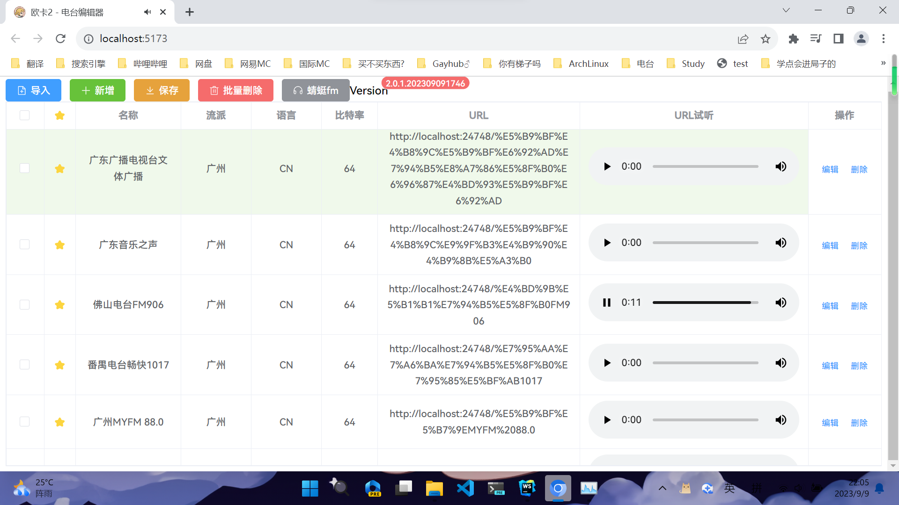

<h2 align="center" style="font-weight: 600">欧卡2-电台编辑器</h2>
<p align="center">
    <s>高颜值的</s>第三方欧卡2电台编辑器
    <br />
    Version: 2.0.1.202309091746
    <!-- <a href="https://music.qier222.com" target="blank"><strong>🌎 访问DEMO</strong></a>  |  
    <a href="#%EF%B8%8F-安装" target="blank"><strong>📦️ 下载安装包</strong></a>  |  
    <a href="https://t.me/yesplaymusic" target="blank"><strong>💬 加入交流群</strong></a>
    <br />
    <br /> -->
  </p>
</p>

## ✨ 特性

- ✅ 使用 Vue3 开发 在线使用无需下载
- 📃 支持电台文件解析 更加美观
- 🧩 可视化在线编辑电台内容 告别枯燥的文本
- 💾 修改后下载直接覆盖原文件即可使用
- ✔️ 可以多选操作 一键删除不要的电台
- 📻 支持蜻蜓fm电台页转直链
- 🖥️ 支持 PWA，可在 Chrome/Edge 里点击地址栏右边的 ➕ 安装到电脑

## 🛠️ 开发&打包

- 安装项目依赖

```shell
npm install
```

## 💻 开发

- 运行本项目

```shell
npm run dev
```

## 📦️ 打包

- 直接 git clone 然后[安装依赖](#️-开发打包)打包即可

```shell
npm run build
```

## ☑️ Todo

1. 双击修改
2. 一键从蜻蜓 fm 导入电台(现在还是不太方便)

欢迎提 Issue 和 Pull request。

## 📜 开源许可

本项目仅供个人学习研究使用，禁止用于商业及非法用途。

基于 [GNU GPL v3](https://www.gnu.org/licenses/gpl-3.0.en.html#license-text) 许可进行开源。

## 🖼️ 截图



